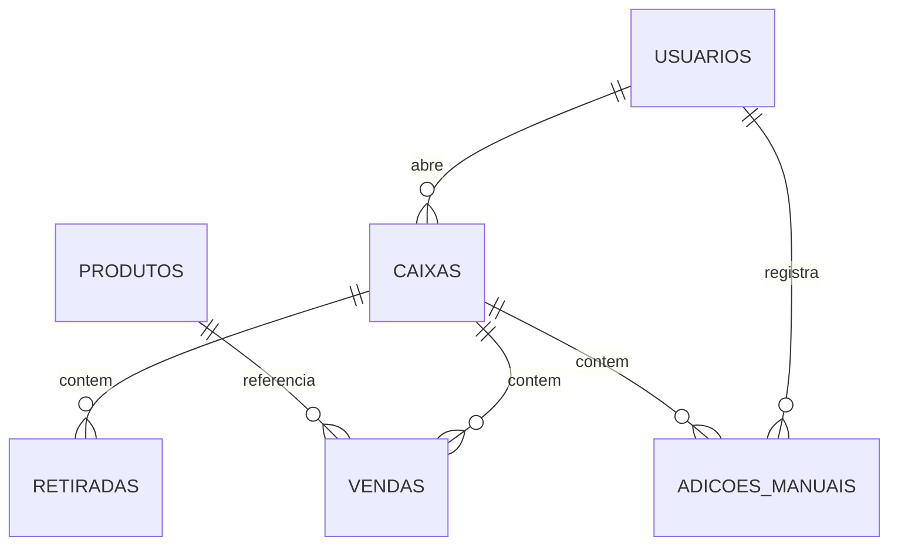

# 🔧 Documentação Técnica - Mande Flores

> Documentação completa para desenvolvedores e equipe técnica.

## 📑 Índice

1. [Arquitetura do Sistema](#1-arquitetura-do-sistema)
2. [Estrutura de Pastas](#2-estrutura-de-pastas)
3. [Banco de Dados](#3-banco-de-dados)
4. [APIs e Integrações](#4-apis-e-integrações)
5. [Segurança](#5-segurança)
6. [Funções Principais](#6-funções-principais)
7. [Guia de Desenvolvimento](#7-guia-de-desenvolvimento)

---

## 1. Arquitetura do Sistema

### Visão Geral

O sistema segue uma arquitetura **client-side** com backend serverless (Supabase).

```
┌─────────────────────────────────────────┐
│           FRONTEND (Cliente)            │
│  ┌───────────────────────────────────┐  │
│  │  HTML/CSS/JavaScript (Vanilla)    │  │
│  │  - TailwindCSS (Styling)          │  │
│  │  - jsPDF (PDF Generation)         │  │
│  │  - Anime.js (Animations)          │  │
│  └───────────────────────────────────┘  │
└─────────────────────────────────────────┘
                    ↕
┌─────────────────────────────────────────┐
│      BACKEND (Supabase - BaaS)          │
│  ┌───────────────────────────────────┐  │
│  │  PostgreSQL Database              │  │
│  │  - Tables & Relations             │  │
│  │  - Row Level Security (RLS)       │  │
│  │  - Functions & Triggers           │  │
│  └───────────────────────────────────┘  │
│  ┌───────────────────────────────────┐  │
│  │  Authentication                   │  │
│  │  - Email/Password                 │  │
│  │  - Session Management             │  │
│  └───────────────────────────────────┘  │
└─────────────────────────────────────────┘
                    ↕
┌─────────────────────────────────────────┐
│         APIS EXTERNAS                   │
│  - BrasilAPI (Feriados)                 │
└─────────────────────────────────────────┘
```

### Tecnologias Utilizadas

| Camada | Tecnologia | Versão | Propósito |
|--------|-----------|--------|-----------|
| Frontend | HTML5 | - | Estrutura |
| Frontend | TailwindCSS | 3.x | Estilização |
| Frontend | JavaScript | ES6+ | Lógica |
| Frontend | jsPDF | 2.5.1 | Geração de PDF |
| Frontend | Anime.js | 3.2.1 | Animações |
| Backend | Supabase | Latest | BaaS |
| Database | PostgreSQL | 14+ | Banco de dados |
| API | BrasilAPI | v2 | Feriados |

---

## 2. Estrutura de Pastas

```
mande-flores/
├── assets/
│   └── images/
│       └── logo.png              # Logo da empresa
├── css/
│   └── styles.css                # Estilos customizados (se houver)
├── js/
│   ├── auth.js                   # Autenticação e sessão
│   ├── caixa.js                  # Lógica do caixa (principal)
│   ├── caixas-pdf.js             # PDFs de caixas históricos
│   ├── config.js                 # Configurações do Supabase
│   ├── dashboard.js              # Dashboard principal
│   ├── historico.js              # Histórico de caixas
│   ├── notificacoes.js           # Sistema de notificações
│   ├── produtos.js               # Gestão de produtos
│   ├── usuarios.js               # Gestão de usuários
│   └── utils.js                  # Funções utilitárias
├── docs/
│   ├── database/
│   │   ├── 01_usuarios.sql       # Schema de usuários
│   │   ├── 02_produtos.sql       # Schema de produtos
│   │   ├── 03_caixas.sql         # Schema de caixas
│   │   ├── 04_vendas.sql         # Schema de vendas
│   │   ├── 05_retiradas.sql      # Schema de retiradas
│   │   ├── 06_feriados.sql       # Schema de feriados
│   │   ├── 07_auditoria.sql      # Schema de auditoria
│   │   ├── 08_funcoes.sql        # Funções SQL
│   │   ├── 09_politicas.sql      # Políticas RLS
│   │   └── 10_adicoes_manuais.sql # Schema de adições
│   ├── MANUAL_USUARIO.md         # Manual do usuário
│   ├── DOCUMENTACAO_TECNICA.md   # Este arquivo
│   ├── FLUXOGRAMAS.md            # Fluxogramas do sistema
│   └── FAQ.md                    # Perguntas frequentes
├── admin.html                    # Painel administrativo
├── caixa.html                    # Página principal do caixa
├── dashboard.html                # Dashboard
├── historico.html                # Histórico de caixas
├── index.html                    # Login
└── README.md                     # Documentação principal
```

---

## 3. Banco de Dados

### Schema Completo

#### Tabela: `usuarios`
```sql
CREATE TABLE usuarios (
    id UUID PRIMARY KEY DEFAULT uuid_generate_v4(),
    nome VARCHAR(255) NOT NULL,
    usuario VARCHAR(100) UNIQUE NOT NULL,
    cargo VARCHAR(50) NOT NULL CHECK (cargo IN ('admin', 'gerente', 'operador')),
    senha_hash TEXT NOT NULL,
    senha_mestra TEXT,
    ativo BOOLEAN DEFAULT true,
    criado_em TIMESTAMP DEFAULT NOW(),
    atualizado_em TIMESTAMP DEFAULT NOW()
);
```

**Índices**:
- `idx_usuarios_usuario` em `usuario`
- `idx_usuarios_cargo` em `cargo`

#### Tabela: `produtos`
```sql
CREATE TABLE produtos (
    id UUID PRIMARY KEY DEFAULT uuid_generate_v4(),
    nome VARCHAR(255) NOT NULL,
    categoria VARCHAR(100),
    preco DECIMAL(10,2),
    ativo BOOLEAN DEFAULT true,
    criado_em TIMESTAMP DEFAULT NOW()
);
```

#### Tabela: `caixas`
```sql
CREATE TABLE caixas (
    id UUID PRIMARY KEY DEFAULT uuid_generate_v4(),
    data DATE NOT NULL,
    periodo VARCHAR(10) NOT NULL CHECK (periodo IN ('manha', 'noite')),
    saldo_inicial DECIMAL(10,2) NOT NULL,
    saldo_final DECIMAL(10,2),
    usuario_id UUID REFERENCES usuarios(id),
    aberto_em TIMESTAMP DEFAULT NOW(),
    fechado_em TIMESTAMP,
    status VARCHAR(20) DEFAULT 'aberto' CHECK (status IN ('aberto', 'fechado')),
    UNIQUE(data, periodo)
);
```

**Índices**:
- `idx_caixas_data` em `data`
- `idx_caixas_status` em `status`
- `idx_caixas_usuario` em `usuario_id`

#### Tabela: `vendas`
```sql
CREATE TABLE vendas (
    id UUID PRIMARY KEY DEFAULT uuid_generate_v4(),
    caixa_id UUID REFERENCES caixas(id) ON DELETE CASCADE,
    produto_id UUID REFERENCES produtos(id),
    descricao TEXT NOT NULL,
    quantidade INTEGER NOT NULL DEFAULT 1,
    valor DECIMAL(10,2) NOT NULL,
    pagamento VARCHAR(50) NOT NULL,
    observacao TEXT,
    criado_em TIMESTAMP DEFAULT NOW()
);
```

**Índices**:
- `idx_vendas_caixa` em `caixa_id`
- `idx_vendas_pagamento` em `pagamento`

#### Tabela: `retiradas`
```sql
CREATE TABLE retiradas (
    id UUID PRIMARY KEY DEFAULT uuid_generate_v4(),
    caixa_id UUID REFERENCES caixas(id) ON DELETE CASCADE,
    tipo VARCHAR(50) NOT NULL,
    descricao TEXT NOT NULL,
    valor DECIMAL(10,2) NOT NULL,
    criado_em TIMESTAMP DEFAULT NOW()
);
```

#### Tabela: `adicoes_manuais`
```sql
CREATE TABLE adicoes_manuais (
    id UUID PRIMARY KEY DEFAULT uuid_generate_v4(),
    caixa_id UUID REFERENCES caixas(id) ON DELETE CASCADE,
    descricao TEXT NOT NULL,
    valor DECIMAL(10,2) NOT NULL,
    usuario_id UUID REFERENCES usuarios(id),
    criado_em TIMESTAMP DEFAULT NOW()
);
```

#### Tabela: `feriados`
```sql
CREATE TABLE feriados (
    id UUID PRIMARY KEY DEFAULT uuid_generate_v4(),
    data DATE NOT NULL UNIQUE,
    nome VARCHAR(255) NOT NULL,
    tipo VARCHAR(50)
);
```

#### Tabela: `auditoria`
```sql
CREATE TABLE auditoria (
    id UUID PRIMARY KEY DEFAULT uuid_generate_v4(),
    tabela VARCHAR(100) NOT NULL,
    operacao VARCHAR(20) NOT NULL,
    usuario_id UUID REFERENCES usuarios(id),
    dados_antigos JSONB,
    dados_novos JSONB,
    criado_em TIMESTAMP DEFAULT NOW()
);
```

### Relacionamentos



### Funções SQL

#### `validar_senha_mestra(p_senha TEXT)`
```sql
CREATE OR REPLACE FUNCTION validar_senha_mestra(p_senha TEXT)
RETURNS BOOLEAN AS $$
DECLARE
    v_senha_hash TEXT;
BEGIN
    SELECT senha_mestra INTO v_senha_hash
    FROM usuarios
    WHERE cargo IN ('admin', 'gerente')
    AND ativo = true
    LIMIT 1;
    
    RETURN (v_senha_hash = crypt(p_senha, v_senha_hash));
END;
$$ LANGUAGE plpgsql SECURITY DEFINER;
```

#### `registrar_auditoria()`
```sql
CREATE OR REPLACE FUNCTION registrar_auditoria()
RETURNS TRIGGER AS $$
BEGIN
    INSERT INTO auditoria (tabela, operacao, dados_antigos, dados_novos)
    VALUES (
        TG_TABLE_NAME,
        TG_OP,
        row_to_json(OLD),
        row_to_json(NEW)
    );
    RETURN NEW;
END;
$$ LANGUAGE plpgsql;
```

---

## 4. APIs e Integrações

### Supabase Client

**Inicialização** (`js/config.js`):
```javascript
const SUPABASE_URL = 'https://seu-projeto.supabase.co';
const SUPABASE_KEY = 'sua-chave-publica';
const supabase = window.supabase.createClient(SUPABASE_URL, SUPABASE_KEY);
```

**Autenticação**:
```javascript
// Login
const { data, error } = await supabase.auth.signInWithPassword({
    email: usuario,
    password: senha
});

// Logout
await supabase.auth.signOut();

// Verificar sessão
const { data: { session } } = await supabase.auth.getSession();
```

**Queries**:
```javascript
// Select
const { data, error } = await supabase
    .from('vendas')
    .select('*')
    .eq('caixa_id', caixaId)
    .order('criado_em');

// Insert
const { data, error } = await supabase
    .from('vendas')
    .insert({
        caixa_id: caixaId,
        descricao: 'Produto',
        valor: 100.00,
        pagamento: 'dinheiro'
    });

// Update
const { data, error } = await supabase
    .from('caixas')
    .update({ status: 'fechado', fechado_em: new Date() })
    .eq('id', caixaId);

// RPC (chamar função)
const { data, error } = await supabase
    .rpc('validar_senha_mestra', { p_senha: senha });
```

### BrasilAPI

**Consultar Feriados**:
```javascript
async function buscarFeriados(ano) {
    const response = await fetch(`https://brasilapi.com.br/api/feriados/v1/${ano}`);
    const feriados = await response.json();
    return feriados;
}
```

---

## 5. Segurança

### Row Level Security (RLS)

**Políticas de Acesso**:

```sql
-- Usuários só veem seus próprios dados
CREATE POLICY "usuarios_select_own"
ON usuarios FOR SELECT
USING (auth.uid() = id);

-- Apenas admins podem inserir usuários
CREATE POLICY "usuarios_insert_admin"
ON usuarios FOR INSERT
WITH CHECK (
    EXISTS (
        SELECT 1 FROM usuarios
        WHERE id = auth.uid()
        AND cargo = 'admin'
    )
);

-- Todos podem ver vendas do caixa atual
CREATE POLICY "vendas_select_all"
ON vendas FOR SELECT
USING (true);

-- Apenas operadores logados podem inserir vendas
CREATE POLICY "vendas_insert_auth"
ON vendas FOR INSERT
WITH CHECK (auth.uid() IS NOT NULL);
```

### Validação de Senha Mestra

```javascript
async function validarSenhaGerente(senha) {
    const { data, error } = await supabase
        .rpc('validar_senha_mestra', { p_senha: senha });
    
    if (error) {
        console.error('Erro ao validar senha:', error);
        return false;
    }
    
    return data === true;
}
```

### Proteção contra SQL Injection

- ✅ Uso de prepared statements (Supabase)
- ✅ Validação de inputs no frontend
- ✅ Sanitização de dados
- ✅ RLS ativo em todas as tabelas

### Proteção contra XSS

```javascript
// Sanitização de HTML
function sanitizeHTML(str) {
    const div = document.createElement('div');
    div.textContent = str;
    return div.innerHTML;
}
```

---

## 6. Funções Principais

### `caixa.js`

#### `carregarCaixa()`
Carrega ou cria um caixa para o dia atual.

```javascript
async function carregarCaixa() {
    // 1. Busca caixa aberto
    // 2. Se não existe, exibe formulário
    // 3. Se existe, carrega vendas/retiradas/adições
    // 4. Atualiza interface
}
```

#### `registrarVenda(e)`
Registra uma nova venda.

```javascript
async function registrarVenda(e) {
    e.preventDefault();
    // 1. Valida dados
    // 2. Salva no banco
    // 3. Atualiza lista local
    // 4. Atualiza totais
    // 5. Atualiza saldo atual (se dinheiro)
}
```

#### `atualizarTotais()`
Recalcula e atualiza todos os totais.

```javascript
async function atualizarTotais() {
    // 1. Soma total de vendas
    // 2. Soma vendas em dinheiro
    // 3. Soma retiradas
    // 4. Soma adições
    // 5. Calcula saldo atual
    // 6. Atualiza display
}
```

#### `gerarPDF()`
Gera PDF de fechamento.

```javascript
async function gerarPDF() {
    // 1. Coleta dados
    // 2. Calcula totais
    // 3. Cria documento PDF
    // 4. Adiciona cabeçalho
    // 5. Adiciona tabelas
    // 6. Adiciona resumos
    // 7. Baixa arquivo
}
```

### `auth.js`

#### `verificarAutenticacao()`
Verifica se usuário está logado.

```javascript
async function verificarAutenticacao() {
    const session = await supabase.auth.getSession();
    if (!session.data.session) {
        window.location.href = 'index.html';
    }
}
```

### `utils.js`

#### `formatarMoeda(valor)`
Formata número como moeda brasileira.

```javascript
function formatarMoeda(valor) {
    return new Intl.NumberFormat('pt-BR', {
        style: 'currency',
        currency: 'BRL'
    }).format(valor);
}
```

#### `formatarData(data)`
Formata data para padrão brasileiro.

```javascript
function formatarData(data) {
    if (typeof data === 'string' && /^\d{4}-\d{2}-\d{2}$/.test(data)) {
        data = data + 'T00:00:00';
    }
    return new Intl.DateTimeFormat('pt-BR').format(new Date(data));
}
```

---

## 7. Guia de Desenvolvimento

### Setup do Ambiente

1. **Clone o repositório**
```bash
git clone https://github.com/seu-usuario/mande-flores.git
cd mande-flores
```

2. **Configure o Supabase**
- Crie projeto no Supabase
- Execute scripts SQL em ordem
- Copie credenciais

3. **Configure o projeto**
```javascript
// js/config.js
const SUPABASE_URL = 'sua-url';
const SUPABASE_KEY = 'sua-chave';
```

4. **Inicie servidor local**
```bash
python -m http.server 8000
# ou
npx http-server
```

### Adicionando Nova Funcionalidade

1. **Criar branch**
```bash
git checkout -b feature/nova-funcionalidade
```

2. **Desenvolver**
- Adicione HTML se necessário
- Crie/modifique JavaScript
- Teste localmente

3. **Testar**
- Teste todos os fluxos
- Verifique console para erros
- Teste em diferentes navegadores

4. **Commit e Push**
```bash
git add .
git commit -m "feat: descrição da funcionalidade"
git push origin feature/nova-funcionalidade
```

### Convenções de Código

**JavaScript**:
- camelCase para variáveis e funções
- PascalCase para classes
- UPPER_CASE para constantes
- Comentários descritivos
- Async/await para operações assíncronas

**SQL**:
- snake_case para tabelas e colunas
- Prefixo `idx_` para índices
- Prefixo `fk_` para foreign keys

**Git Commits**:
- `feat:` - Nova funcionalidade
- `fix:` - Correção de bug
- `docs:` - Documentação
- `style:` - Formatação
- `refactor:` - Refatoração
- `test:` - Testes

### Debugging

**Console do Navegador**:
```javascript
console.log('Valor:', valor);
console.error('Erro:', error);
console.table(vendas);
```

**Supabase Logs**:
- Acesse Dashboard > Logs
- Filtre por tipo de operação
- Veja queries executadas

---

**Última atualização**: Dezembro 2025
**Versão**: 5.0
