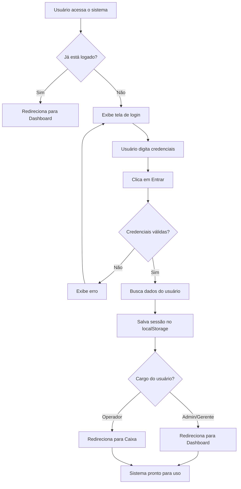
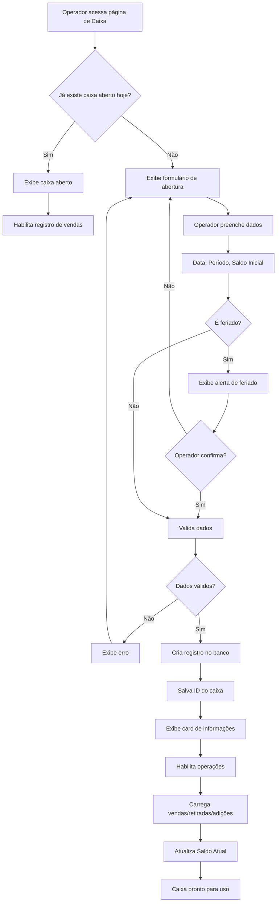
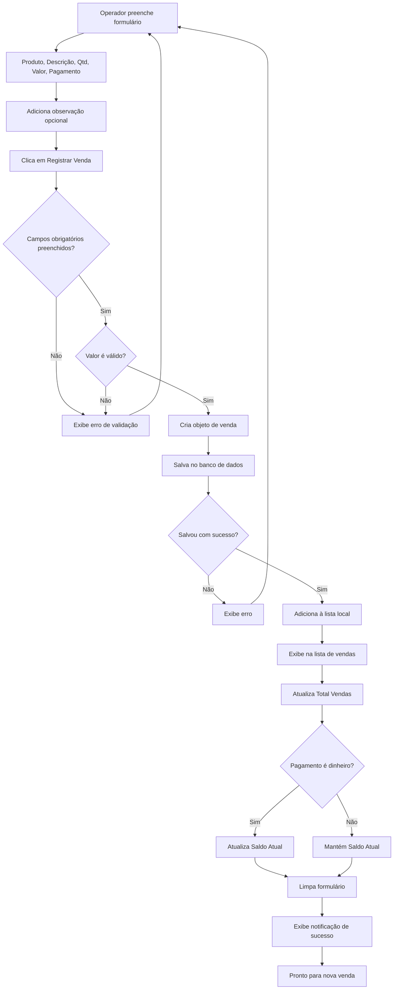
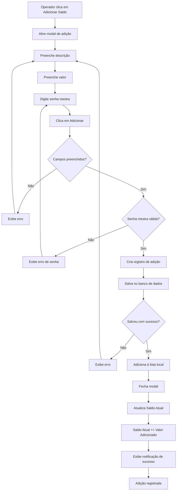
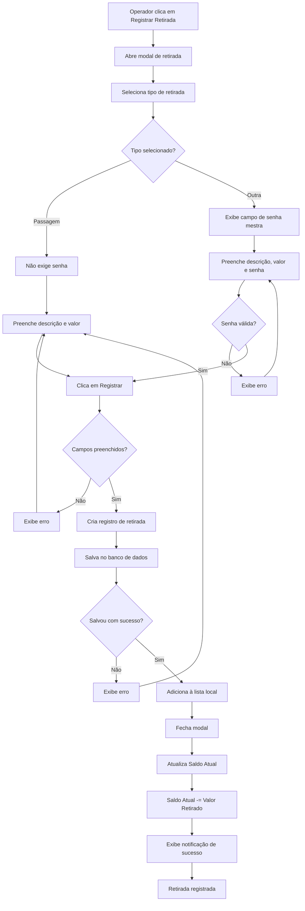
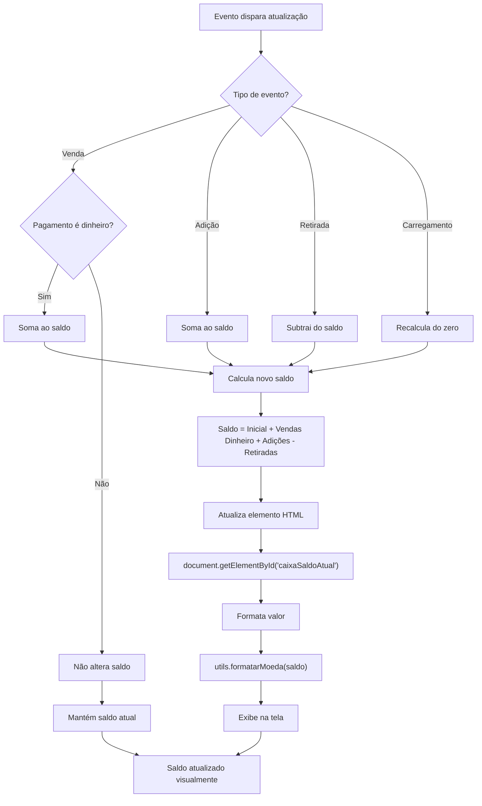
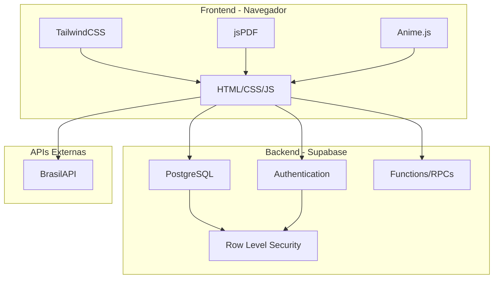
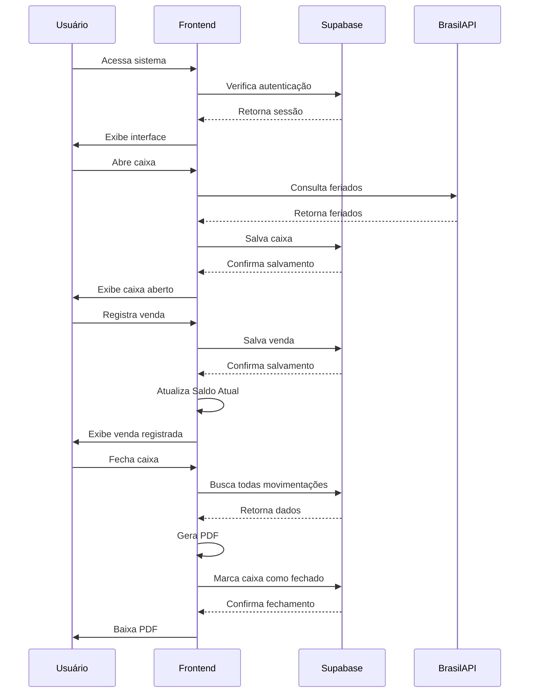

# 📊 Fluxogramas do Sistema - Mande Flores

> Diagramas visuais dos principais fluxos do sistema para facilitar o entendimento.

## 📑 Índice

1. [Fluxo de Autenticação](#1-fluxo-de-autenticação)
2. [Fluxo de Abertura de Caixa](#2-fluxo-de-abertura-de-caixa)
3. [Fluxo de Registro de Venda](#3-fluxo-de-registro-de-venda)
4. [Fluxo de Adição de Saldo](#4-fluxo-de-adição-de-saldo)
5. [Fluxo de Retirada](#5-fluxo-de-retirada)
6. [Fluxo de Fechamento de Caixa](#6-fluxo-de-fechamento-de-caixa)
7. [Fluxo de Atualização do Saldo Atual](#7-fluxo-de-atualização-do-saldo-atual)
8. [Fluxo de Geração de PDF](#8-fluxo-de-geração-de-pdf)

---

## 1. Fluxo de Autenticação

**Descrição**:
1. Sistema verifica se usuário já está autenticado
2. Se não, exibe tela de login
3. Valida credenciais no Supabase
4. Busca informações do usuário (nome, cargo, permissões)
5. Salva sessão localmente
6. Redireciona conforme o cargo

---

## 2. Fluxo de Abertura de Caixa

**Descrição**:
1. Sistema verifica se já existe caixa aberto para a data/período
2. Se sim, carrega o caixa existente
3. Se não, exibe formulário de abertura
4. Verifica se é feriado (via BrasilAPI)
5. Valida dados inseridos
6. Cria registro no banco de dados
7. Carrega todas as movimentações
8. Calcula e exibe Saldo Atual

---

## 3. Fluxo de Registro de Venda

**Descrição**:
1. Operador preenche dados da venda
2. Sistema valida campos obrigatórios
3. Valida formato do valor
4. Salva venda no banco de dados
5. Adiciona à lista local de vendas
6. Atualiza totais
7. Se pagamento for em dinheiro, atualiza Saldo Atual
8. Limpa formulário para próxima venda

---

## 4. Fluxo de Adição de Saldo

**Descrição**:
1. Operador clica no botão verde "Adicionar Saldo"
2. Modal abre com formulário
3. Preenche descrição e valor
4. Sistema valida senha mestra
5. Se válida, salva no banco
6. Atualiza Saldo Atual imediatamente
7. Fecha modal automaticamente

---

## 5. Fluxo de Retirada

**Descrição**:
1. Operador clica em "Registrar Retirada"
2. Seleciona tipo (Passagem ou Outra)
3. Se "Outra", exige senha mestra
4. Preenche dados
5. Valida e salva no banco
6. Atualiza Saldo Atual (diminui)
7. Fecha modal automaticamente

---

## 6. Fluxo de Fechamento de Caixa

```mermaid
flowchart TD
    A[Operador clica em Fechar Caixa] --> B[Sistema coleta dados]
    B --> C[Busca todas as vendas]
    C --> D[Busca todas as retiradas]
    D --> E[Busca todas as adições]
    E --> F[Calcula totais]
    F --> G["Total Vendas, Total Retiradas, Total Adições"]
    G --> H[Calcula Saldo Final]
    H --> I["Saldo Final = Inicial + Vendas + Adições - Retiradas"]
    I --> J[Calcula totais por pagamento]
    J --> K["Dinheiro, PIX, Cartão, etc."]
    K --> L[Calcula Dinheiro Esperado]
    L --> M["Esperado = Inicial + Dinheiro + Adições - Retiradas"]
    M --> N[Gera PDF]
    N --> O[Adiciona cabeçalho]
    O --> P[Adiciona informações do caixa]
    P --> Q[Adiciona tabela de vendas]
    Q --> R[Adiciona resumo financeiro]
    R --> S[Adiciona detalhamento por pagamento]
    S --> T[Adiciona conferência de dinheiro]
    T --> U{Tem retiradas?}
    U -->|Sim| V[Adiciona seção de retiradas]
    U -->|Não| W{Tem adições?}
    V --> W
    W -->|Sim| X[Adiciona seção de adições]
    W -->|Não| Y[Finaliza PDF]
    X --> Y
    Y --> Z[Baixa PDF]
    Z --> AA[Atualiza status do caixa]
    AA --> AB[Marca como fechado no banco]
    AB --> AC[Limpa dados locais]
    AC --> AD[Exibe notificação]
    AD --> AE[Redireciona para nova abertura]
```

**Descrição**:
1. Sistema coleta todas as movimentações do dia
2. Calcula todos os totais necessários
3. Gera PDF com layout profissional
4. Inclui todas as seções (vendas, resumo, conferência, retiradas, adições)
5. Baixa PDF automaticamente
6. Marca caixa como fechado no banco
7. Limpa interface para novo caixa

---

## 7. Fluxo de Atualização do Saldo Atual

**Descrição**:
1. Qualquer operação dispara atualização
2. Sistema identifica tipo de operação
3. Calcula impacto no saldo:
   - Venda em dinheiro: +valor
   - Adição: +valor
   - Retirada: -valor
   - Outras vendas: sem impacto
4. Recalcula saldo total
5. Atualiza display na tela
6. Formata como moeda brasileira

---

## 8. Fluxo de Geração de PDF

```mermaid
flowchart TD
    A[Início da geração] --> B[Inicializa jsPDF]
    B --> C[Define cores e estilos]
    C --> D[Adiciona cabeçalho roxo]
    D --> E[Adiciona logo e título]
    E --> F[Adiciona informações do caixa]
    F --> G["Data, Período, Horários"]
    G --> H{Tem vendas?}
    H -->|Sim| I[Cria tabela de vendas]
    I --> J[Adiciona colunas]
    J --> K["Qtd, Descrição + Obs, Pagamento, Valor"]
    K --> L[Popula com dados]
    L --> M[Aplica estilo striped]
    M --> N[Verifica espaço na página]
    N --> O{Precisa nova página?}
    O -->|Sim| P[Adiciona nova página]
    O -->|Não| Q[Continua na mesma]
    P --> Q
    H -->|Não| Q
    Q --> R[Adiciona Resumo Financeiro]
    R --> S[Caixa cinza com título]
    S --> T[Lista valores]
    T --> U["Inicial, Vendas, Adições, Retiradas"]
    U --> V[Adiciona linha separadora]
    V --> W[Destaca Saldo Final em roxo]
    W --> X[Adiciona Detalhamento por Pagamento]
    X --> Y[Lista cada forma de pagamento]
    Y --> Z[Adiciona Conferência de Dinheiro]
    Z --> AA[Caixa amarelo com cálculo]
    AA --> AB["Inicial + Dinheiro + Adições - Retiradas"]
    AB --> AC{Tem retiradas?}
    AC -->|Sim| AD[Adiciona seção de retiradas]
    AD --> AE[Lista cada retirada]
    AE --> AF[Tipo, Descrição, Valor]
    AC -->|Não| AG{Tem adições?}
    AF --> AG
    AG -->|Sim| AH[Adiciona seção de adições]
    AH --> AI[Lista cada adição]
    AI --> AJ[Descrição, Valor]
    AG -->|Não| AK[Finaliza documento]
    AJ --> AK
    AK --> AL[Gera blob do PDF]
    AL --> AM[Cria nome do arquivo]
    AM --> AN["Fechamento_Caixa_DD-MM-YYYY_PERIODO.pdf"]
    AN --> AO[Dispara download]
    AO --> AP[PDF baixado]
```

**Descrição**:
1. Inicializa biblioteca jsPDF
2. Define paleta de cores (roxo, cinza, verde, vermelho)
3. Adiciona cabeçalho com logo
4. Adiciona informações básicas do caixa
5. Cria tabela de vendas com autoTable
6. Adiciona resumo financeiro com destaque
7. Lista detalhamento por forma de pagamento
8. Adiciona conferência de dinheiro em destaque
9. Se houver, adiciona seções de retiradas e adições
10. Gera arquivo e dispara download

---

## 📊 Diagrama de Arquitetura do Sistema

---

## 🔄 Diagrama de Fluxo de Dados

---

**Última atualização**: Dezembro 2025
**Versão**: 5.0
